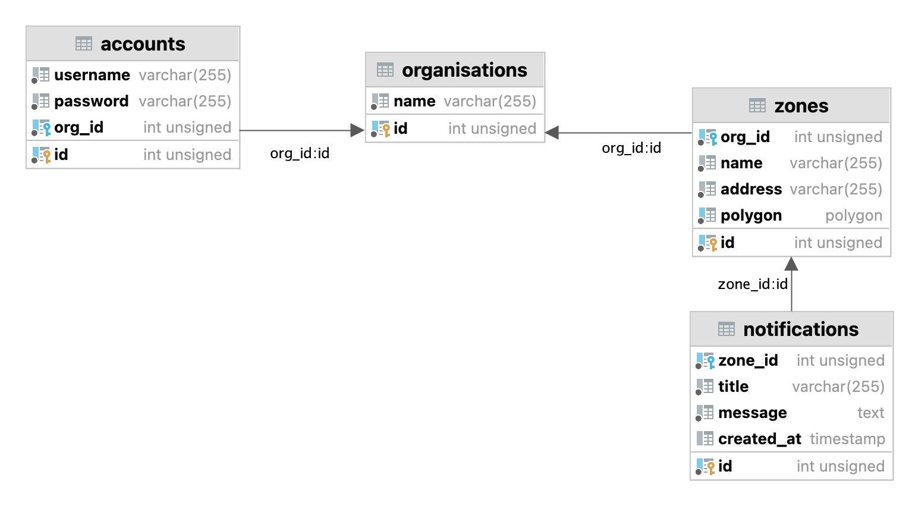

# Backend Overview

This folder contains the source code for the backend API of our project. The backend handles user authentication, data storage, and interactions with the MySQL database. It also provides the API for managing zones, notifications, and user accounts.

The backend is built with **NodeJS**, **ExpressJS** and uses **MySQL** for the database.

## Setup

### Prerequisites

- **Node.js**: Make sure you have Node.js installed. You can download it from [nodejs.org](https://nodejs.org/).
- **MySQL**: A MySQL server is required to run the backend locally. You can use a local installation (e.g., MAMP, XAMPP) or a cloud-based solution (e.g., AWS RDS).
  
### Running with the Hosted Frontend

The backend is hosted at `https://deco3801-machineleads.uqcloud.net/`, and no further configuration is needed. The frontend will communicate directly with the backend.

### Running Locally

If you prefer to run the backend locally, follow these steps:

1. **Clone the repository**:
   ```shell
   cd backend/
   ```

2. **Install dependencies**:
   ```shell
   npm install
   ```

3. **Environment Variables**:

   You need to create a `.env` file in the root of the `backend` folder with the following content:

   ```bash
   API_KEY=put-your-API-key-here

   MYSQL_HOST=127.0.0.1                 # For localhost
   MYSQL_USER=your-mysql-username       # Replace it with your MySQL username
   MYSQL_PASSWORD=your-mysql-password   # Replace it with your MySQL password
   MYSQL_DATABASE=your-database-name    # Replace it with your database name
   MYSQL_PORT=your-mysql-port           # Replace it with your MySQL port

   JWT_SECRET=put-the-JWT-secret-here
   ```

   - Replace the values according to your local setup.

4. **Database Setup**:

   Ensure that you have MySQL running and create the database `mly` (or another database name that you specify in the `.env` file).

   This is the database design for setting up the database:
   

5. **Install dependencies**

    You only need to do this at the first time, or after anything changes in `package.json` and `package-lock.json`

    ```shell
    cd backend/
    npm install
    ```

6. **Start the Server**:

   ```shell
   cd backend/
   node index.js
   ```

   The backend will be available at `http://localhost:8081` by default.

7. **Connecting to the Frontend**:

   If you're running the frontend locally as well, make sure to change the frontend's API proxy to point to `http://localhost:8081`.

## API Endpoints

### Authentication

- **POST `/api/login`**: Logs in a user and returns a JWT token.
  - **Request Body**:
    ```json
    {
      "username": "your-username",
      "password": "your-password"
    }
    ```
  - **Response**:
    ```json
    {
      "token": "jwt-token",
      "message": "Login successful"
    }
    ```

- **POST `/api/signup`**: Registers a new user.
  - **Request Body**:
    ```json
    {
      "username": "new-username",
      "password": "new-password",
      "confirmPassword": "new-password",
      "organisationName": "Org Name"
    }
    ```
  - **Response**:
    ```json
    {
      "message": "Account created successfully"
    }
    ```

### Zones

- **POST `/api/zones`**: Creates a new zone.
  - **Request Body**:
    ```json
    {
      "org_id": 1,
      "name": "Zone Name",
      "address": "Zone Address",
      "polygon": [[153.01, -27.49], [153.02, -27.48], [153.03, -27.47]]  // Coordinates in [longitude, latitude]
    }
    ```

- **GET `/api/zones`**: Retrieves all zones or zones associated with an organization (via `orgId` query parameter).
  - **Response**:
    ```json
    [
      {
        "id": 1,
        "name": "Zone Name",
        "address": "Zone Address",
        "polygon": [[153.01, -27.49], [153.02, -27.48], [153.03, -27.47]]
      }
    ]
    ```

### Notifications

- **POST `/api/notifications`**: Creates a new notification for one or more zones.
  - **Request Body**:
    ```json
    {
      "title": "New Notification",
      "message": "Notification message",
      "zones": [1, 2]  // Array of zone IDs
    }
    ```

- **GET `/api/notifications`**: Retrieves all notifications or notifications from a specific zone (via `zoneId` query parameter).

## Middleware

- **CORS**: CORS is enabled, allowing requests from all origins.
- **API Key**: The API routes are protected by an API key that must match the key in the `.env` file. You need to send the `x-api-key` header with each request.
